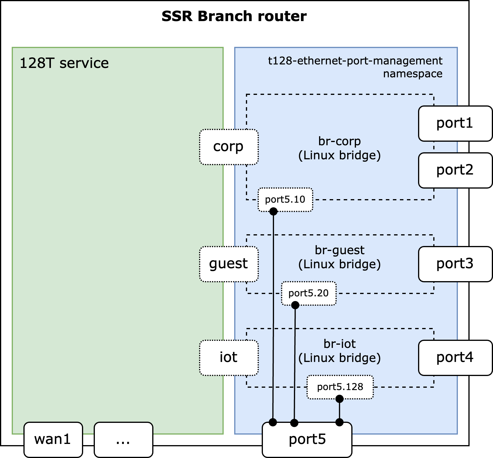
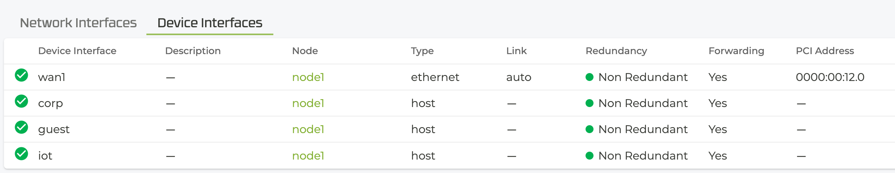

# t128-ethernet-port-management

Setup Linux bridges for a given SSR interface configuration.


## Introduction

Typically, ethernet ports of an SSR router are configured as single port layer 2 devices with layer 3 routing capabilities.

In some situations (especially in very small branches) it may be desirable to combine ports of a router to a layer 2 group instead of using a separate ethernet switch. Technically, this is supported through Linux network bridges.

This tool takes a configuration file and configures ethernet ports of an SSR router for local networks. It also allows to aggregate multiple networks using VLANs like a switching trunk port.




## Configuration

Before the `t128-ethernet-port-management` tool will be installed it is necessary to create the SSR config with its device und network-interface elements.  In the examples of this document there will be 3 logical networks:

* corp
* guest
* iot

For each logical network that should be part of a port group (bridge) the SSR router requires an interface of type `host`. These interfaces are configured similar to an ethernet interface. They can contain IP addresses, dhcp-server, host-services, etc.

Furthermore, a mapping of ports (PCI addresses) to logical networks has to be provided. To identify the PCI addresses of the physical ports of your router please consult the vendors manual.  [For the Juniper SSR router series please refer to this page](https://www.juniper.net/documentation/us/en/software/session-smart-router/docs/hdwr_ssr_device_port_layout/). Each port can be assigned to one (and only one) logical network, unless it is a trunk port that is configured to separate the networks by VLAN tags.

In the example below the `corp` network is connected to port1 and port2 (0000:00:13.0 and 0000:00:14.0), `guest` to port3 (0000:00:15.0) and `iot` to port4 (0000:00:16.0). All 3 networks are also connected to port5 (0000:00:17.0) using VLAN IDs `10` (for corp), `20` (for guest) and `128` (for iot). As outlined before, the PCI addresses may vary for your router model.

```
ports:
  - '0000:00:13.0': corp
  - '0000:00:14.0': corp
  - '0000:00:15.0': guest
  - '0000:00:16.0': iot
  - '0000:00:17.0':
      -  10: corp
      -  20: guest
      - 128: iot
```
A corresponding SSR router config should look similar to this:

```
config
    authority
        router  test-branch
            node  node1
                device-interface  corp
                    type               host
                    network-namespace  t128-ethernet-port-management
                    network-interface  corp
                        address  192.168.10.1
                            prefix-length  24
                        exit
                    exit
                exit
                device-interface  guest
                    type               host
                    network-namespace  t128-ethernet-port-management
                    network-interface  guest
                        address  192.168.20.1
                            prefix-length  24
                        exit
                    exit
                exit
                device-interface  iot
                    type               host
                    network-namespace  t128-ethernet-port-management
                    network-interface  iot
                        address  192.168.128.1
                            prefix-length  24
                        exit
                    exit
                exit
            exit
        exit
    exit
exit

```

## Installation

The application files and its configuration must be installed on each SSR router node that should implement the Linux bridges.

The recommended way is to use a salt state on the _conductor_ like this:

```
$ ls -1 /srv/salt/t128-ethernet-port-management.*
/srv/salt/t128-ethernet-port-management.pyz
/srv/salt/t128-ethernet-port-management.sls

$ sudo cat /srv/salt/t128-ethernet-port-management.sls





t128-ethernet-port-management config:
  file.managed:
    - name: {{ config_file }}
    - mode: 644
    - contents: |
        debug: false
        ports:
          - '0000:00:13.0': corp
          - '0000:00:14.0': corp
          - '0000:00:15.0': guest
          - '0000:00:16.0': iot
          - '0000:00:17.0':
              - 10: corp
              - 20: guest
              - 128: iot

t128-ethernet-port-management script:
  file.managed:
    - name: {{ sbin_path }}/{{ pyz }}
    - mode: 755
    - source: salt://{{ pyz }}

t128-ethernet-port-management wrapper:
  file.managed:
    - name: {{ sbin_path }}/{{ wrapper }}
    - mode: 755
    - contents: |
        #!/bin/sh
        exec {{ sbin_path }}/{{ pyz }} "$0" "$@"

t128-ethernet-port-management create symlinks:
  cmd.run:
    - name: {{ sbin_path }}/{{ wrapper }} --create-symlinks
    - onchanges:
      - file: {{ config_file }}
```

The two files need to be placed in `/srv/salt` on the conductor:

* t128-ethernet-port-management.sls
* t128-ethernet-port-management.pyz

If there are different site types and/or different hardware configurations each type/configuration can be deployed by a dedicated salt state (`*.sls`). In order to assign the target sites/routers it is recommended to use salt grains to select facts based on hardware attributes. 

The bridge configguration (port to network assignment) is done inside the `t128-ethernet-port-management.sls` file (see `ports` section). This assignment is used to generate a configuration file (`/etc/128technology/t128-ethernet-port-management.yaml`) on the target router.

To test the deployment of `t128-ethernet-port-management` the admin can either assign the salt state to a selected minion id in /srv/salt/top.sls on the _conductor_ or simply run this command on the target _router_:

```
$ sudo salt-call -l debug state.apply t128-ethernet-port-management
```

## Port Status

The SSR conductor provides some insights about the health of connected ethernet ports. This script also provides basic capabilities using the `monitoring` plugins/network-scripts framework. It uses ethtool to monitor the phyiscal link status.

In case of a 1:1 mapping, when a network is connected to exactly one port, the network status is equivalent to the port status. If there are more ports connected to a network, the network status follows an "all-or-nothing" logic (`green` when all ports are connected, `red` when there is at least one disconnected port).



## Limitations

* The Performance of Linux bridges is limited to the design of the Linux networking stack. The expected troughput for all ports should not exceed 100 Mbps.
* Each logical network adds ~10% of CPU usage, because of the KNI that is needed for the host interface. It is not recommended to add more than a few networks to a branch router like SSR120 or SSR130.
* Configuration cannot be done in SSR config on the conductor. It is assumed that the target deployment is almost identical and the salt state can be used as a cookie-cutter. Also the hardware should be the same or at least the PCI addresses must match, otherwise a separate salt state (config file) is required for each hardware model.